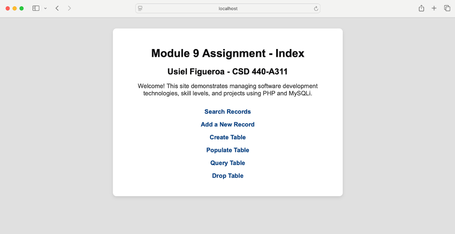
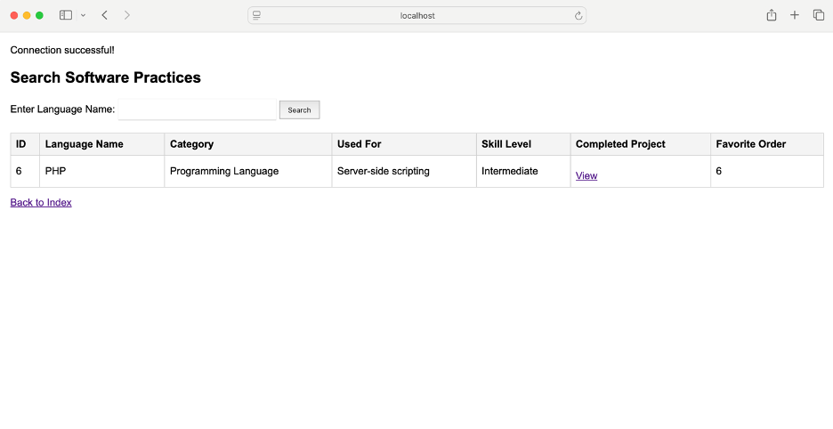
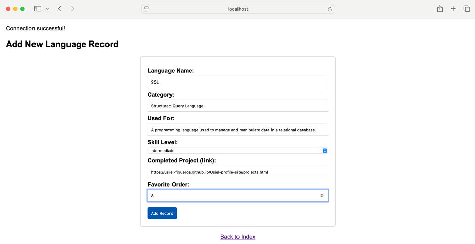

Module 9 - Software Practices Database Project

Author: Usiel Figueroa
Date: September 22, 2025
Course: CSD 440-A311 Server-Side Scripting
Instructor: Professor Elijah Finch

Project Overview

This project demonstrates the use of PHP and MySQLi to manage a database of software development technologies and practices. The website allows users to:

Create, populate, and drop a MySQL table

Add new records via a web form

Query the database for specific software development technologies

View all records in a structured, user-friendly format

The database focuses on software development technologies, including Python, Java, HTML, CSS, JavaScript, PHP, and DevOps, with associated categories, use cases, skill levels, and completed project references.

Technologies Used

PHP 8.x

MySQL 8.x / MariaDB

XAMPP 8.2.4-0 (Apache, MySQL)

HTML & CSS for styling

PHP MySQLi with prepared statements

Database Structure

Database: baseball_01
Table: software_practices

Field	Type	Description
id	INT AUTO_INCREMENT PRIMARY KEY	Unique record identifier
language_name	VARCHAR(50)	Name of the language or technology
category	VARCHAR(50)	Category type (Programming, Markup, Stylesheet, etc.)
used_for	VARCHAR(400)	Description of typical use or application
skill_level	VARCHAR(20)	Beginner, Intermediate, Advanced
completed_project	VARCHAR(255)	URL to example project
favorite_order	INT	User preference or ranking (1 = most favorite)
File Structure
File	Purpose
UsielIndex.php	Index page with navigation links to all project pages
UsielCreateTable.php	Creates the software_practices table
UsielDropTable.php	Drops the table if it exists
UsielPopulateTable.php	Populates the table with initial sample data using prepared statements
UsielQuery.php	Form and script to search for records by language name
UsielForm.php	Form to add a new software technology record
db_config.php	Database connection configuration
README.md	Project documentation
Quick Start
1. Install XAMPP

Download and install XAMPP for your operating system:
https://www.apachefriends.org/download.html

2. Start Apache & MySQL

Open the XAMPP Control Panel and start Apache and MySQL.
Note the port numbers (default Apache: 80 or 8888, MySQL: 3306 or 3307).

3. Configure Database Connection

Update db_config.php with your MySQL credentials:

$servername = "localhost";
$username   = "student1";
$password   = "pass";
$dbname     = "baseball_01";
$port       = 3307;

4. Place Project Files

Copy all project files to the htdocs folder inside XAMPP:

C:\xampp\htdocs\   (Windows)
OR
/Applications/XAMPP/xamppfiles/htdocs/   (macOS)

5. Open in Browser

Access the index page:

http://localhost:8888/software_practices/UsielIndex.php

6. Workflow

Create Table → Creates the software_practices table

Populate Table → Adds initial data using prepared statements

Search Records → Query the table by language name

Add a New Record → Insert additional software technologies

Drop Table → Remove the table if needed

Usage

Search Function: Enter a language name (or part of it) to find records

Add Function: Fill in all required fields to insert a new record

Features

Fully documented PHP scripts

Meaningful variable names and readable formatting

HTML output without relying on echo

CSS styling for readability (grey and white themed)

SQL prepared statements for security against SQL injection

Dynamic search and form functionality

Screenshots
Index Page

Search Records

Add New Record

References

Tatroe, K., & MacIntyre, P. (2020). Programming PHP: Creating dynamic web pages (4th ed.). O’Reilly Media.

[Design and Development - Video Production]. (2021, June 16). Database Form [Video]. Bellevue University. Link

Notes

Modify used_for column length for long descriptions (currently VARCHAR(400))